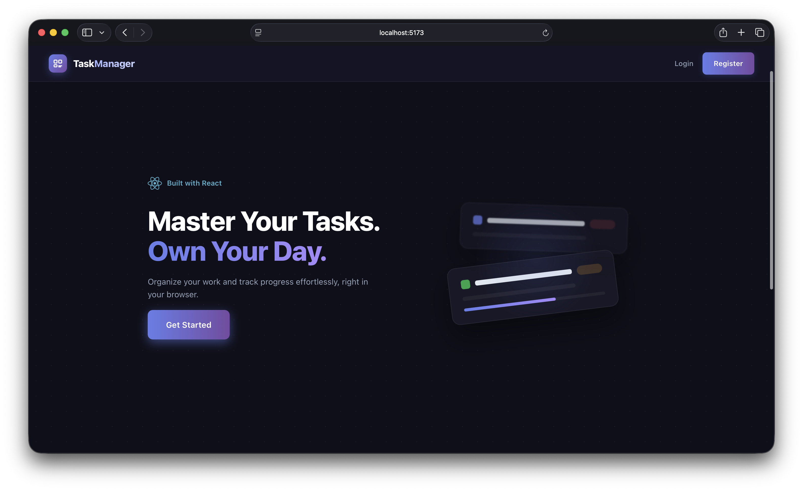
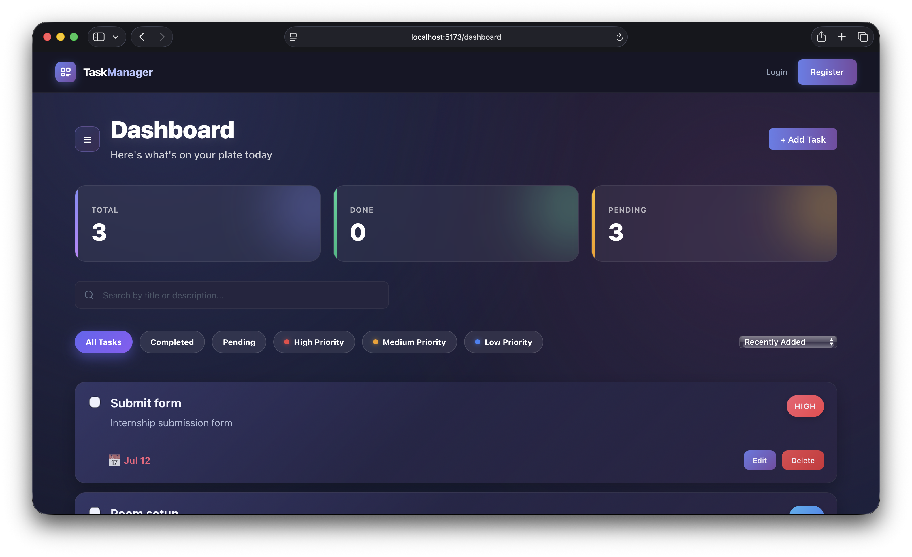
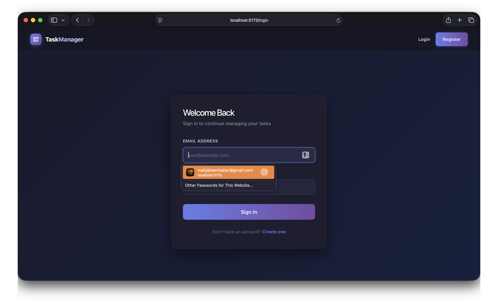
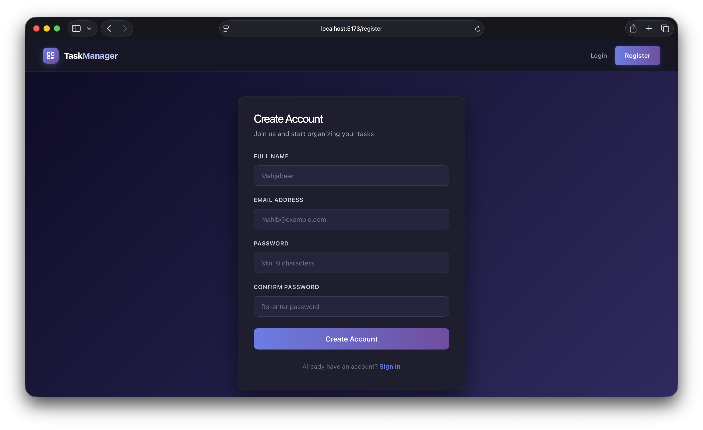
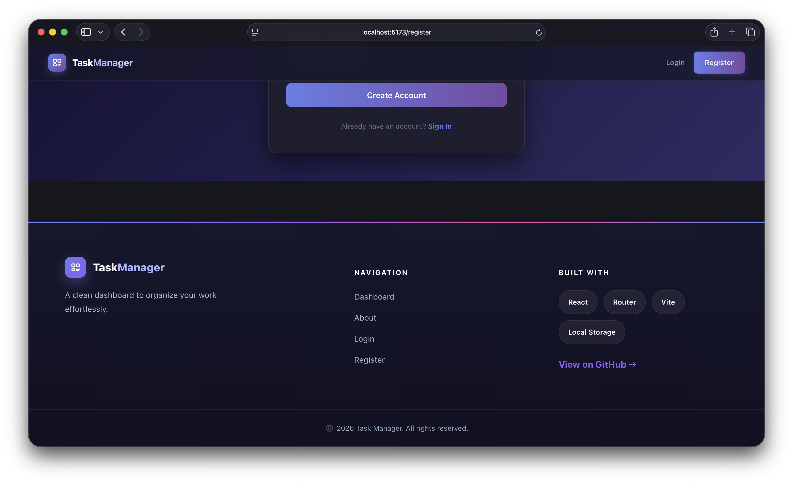
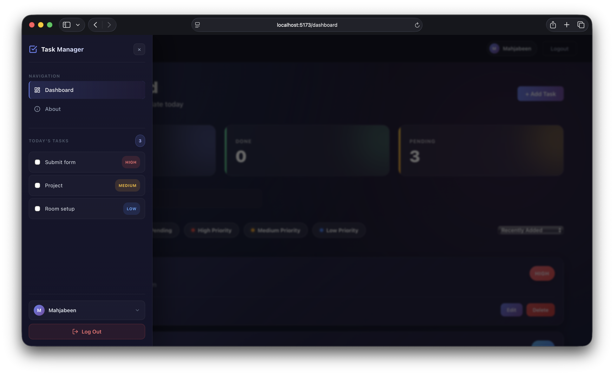

# React Task Manager

A responsive task management application built with React that helps users organize daily tasks through a clean and intuitive interface. The application stores data locally using the browser's Local Storage, so tasks remain available even after refreshing the page.

---

## Features

- Authentication interface with Login and Register pages
- Create, edit, and delete tasks
- Mark tasks as completed or pending
- Set task priorities (High, Medium, Low)
- Add descriptions and due dates
- Search tasks by title or description
- Filter tasks by status or priority
- Sort tasks by recent, due date, or priority
- Persistent data using Local Storage
- Responsive design for different screen sizes

---

## Tech Stack

- React
- React Router DOM
- Vite
- CSS Modules
- Context API
- Custom React Hooks
- Local Storage

---

## Installation

Clone the repository:

```bash
git clone https://github.com/Mahjabeen244/react-task-manager.git
```

Move into the project folder:

```bash
cd react-task-manager
```

Install the dependencies:

```bash
npm install
```

Run the development server:

```bash
npm run dev
```

---

## Project Structure

```text
src
├── assets/
├── components/
├── context/
├── hooks/
├── pages/
├── services/
├── utils/
├── App.jsx
└── main.jsx
```

### Folder Overview

| Folder     | Purpose                 |
| ---------- | ----------------------- |
| components | Reusable UI components  |
| pages      | Application pages       |
| hooks      | Custom React hooks      |
| context    | Global state management |
| services   | Local Storage logic     |
| utils      | Helper functions        |
| assets     | Static assets           |

---

## Screenshots








---

## Future Improvements

- Backend integration
- User authentication
- Cloud database support
- Drag-and-drop task management
- Theme switching (Light/Dark mode)

---

## Author

Mahjabeen Nadeem

GitHub: https://github.com/Mahjabeen244
